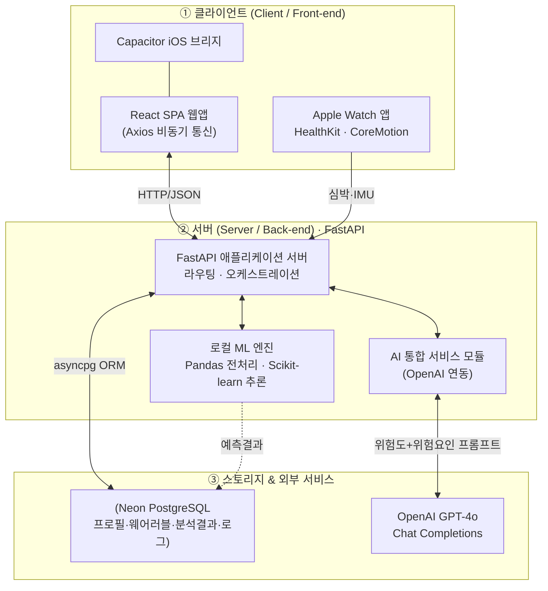
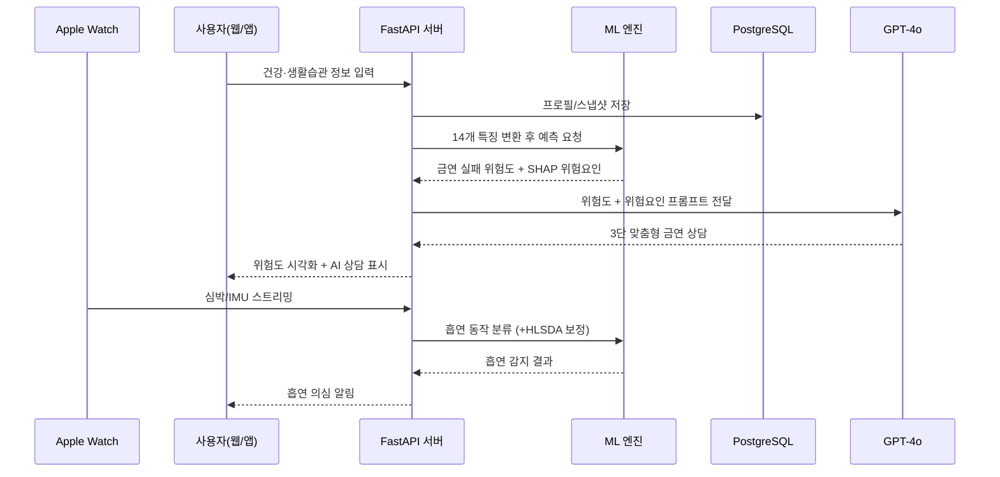

# 머신러닝과 생성형 AI 기반 금연 지원 시스템
### Machine Learning and LLM-Based Smoking Cessation Support System

> 사용자의 건강·생활습관 데이터로 **금연 실패(재흡연) 위험도**를 예측하고,
> Apple Watch 센서로 **흡연 행동을 실시간 감지**하며,
> 생성형 AI(GPT-4o)가 **개인 맞춤형 금연 상담**을 제공하는 통합 헬스케어 시스템입니다.

계명대학교 캡스톤디자인 4팀 · 의용공학과 / 컴퓨터공학과
(대한전자공학회 논문 게재 — RISE 지역혁신중심 대학지원체계 지원, 과제번호 2026-RISE-03-002)

---

## 목차
- [프로젝트 개요](#프로젝트-개요)
- [핵심 기능](#핵심-기능)
- [시스템 아키텍처](#시스템-아키텍처)
- [기술 스택](#기술-스택)
- [AI 모델 상세](#ai-모델-상세)
  - [모델 1. 금연 실패 위험도 예측 (RF + XGBoost 앙상블)](#모델-1-금연-실패-위험도-예측-rf--xgboost-앙상블)
  - [모델 2. 흡연 행동 감지 (IMU 기반 2-Layer)](#모델-2-흡연-행동-감지-imu-기반-2-layer)
  - [생성형 AI 상담 모듈 (GPT-4o)](#생성형-ai-상담-모듈-gpt-4o)
- [웨어러블 연동 (Apple Watch)](#웨어러블-연동-apple-watch)
- [데이터 흐름](#데이터-흐름)
- [저장소 구조](#저장소-구조)
- [실행 방법](#실행-방법)
- [팀 & 참고문헌](#팀--참고문헌)

---

## 프로젝트 개요

금연을 시도하는 많은 사용자가 니코틴 의존, 스트레스, 음주 습관, 간접흡연 환경 등
복합적인 요인으로 인해 **재흡연**을 겪습니다. 기존 금연 앱은 대부분 사용자의 **주관적 기록**에
의존해, 개개인의 상태 변화에 대한 **선제적 대응**이 어렵습니다.

본 시스템은 이를 데이터 기반으로 해결합니다.

1. **정량적 예측** — 머신러닝으로 금연 실패 위험도를 수치화하고, SHAP으로 주요 위험 요인을 도출
2. **실시간 감지** — Apple Watch의 가속도·자이로 센서로 흡연으로 의심되는 손동작을 탐지
3. **개인화 상담** — 예측 결과와 위험 요인을 생성형 AI(GPT-4o)에 전달해 맞춤형 금연 조언 생성

> 데이터 → 예측 → 자연어 조언으로 이어지는 파이프라인을 통해 금연 유지율을 높이고 재흡연을 예방하는 것을 목표로 합니다.

---

## 핵심 기능

| 구분 | 기능 |
|------|------|
| 🧠 위험도 예측 | 14개 건강·생활습관 특징 기반 금연 실패 위험도(%) 산출 (RF+XGBoost 앙상블) |
| 🔍 설명가능성 | SHAP 분석으로 개인별 주요 위험 요인(스트레스·음주·간접흡연·BMI 등) 도출 |
| 🚬 흡연 감지 | 워치 IMU 센서 → 흡연 손동작 실시간 분류 + HLSDA 시퀀스 후처리 |
| ❤️ 생체 모니터링 | HealthKit 심박수·심박변이도(HRV/RMSSD) 수집, HRV 급상승 시 자동 감지 트리거 |
| 💬 AI 상담 | GPT-4o가 '현재 상태 분석 / 주의해야 할 순간 / 실천 전략' 3단 맞춤 조언 생성 |
| 🏥 보건소 안내 | 공공데이터 API + 지도(Leaflet/MapLibre)로 인근 금연 클리닉·보건소 안내 |
| 👤 회원/알림 | 이메일 인증 회원가입, 비밀번호 재설정, SMS(솔라피) 발송 |
| 📱 멀티 플랫폼 | React 웹(SPA) + Capacitor iOS 앱 + Apple Watch 앱 |

---

## 시스템 아키텍처

3계층(3-Tier) 구조로, **데이터베이스를 매개로 한 '사용자 정보 컨텍스트(User Info Context)'**를
핵심 메커니즘으로 삼아 단순 질의응답을 넘어선 개인화 피드백을 제공합니다.



- **클라이언트** — 웹(React SPA)과 웨어러블(Apple Watch)의 이원화 구조로 접근성 극대화
- **서버** — 고성능 비동기 처리에 강점을 가진 FastAPI가 중앙 제어부 역할. 로컬 ML 엔진에서 직접 추론하고, AI 통합 모듈이 외부 LLM과 통신
- **스토리지/외부** — Neon PostgreSQL이 모든 데이터를 통합 저장, OpenAI GPT-4o가 자연어 피드백 담당
- **배포** — Render (Figure 5의 배포·연결 테스트 참조)

---

## 기술 스택

| 계층 | 기술 |
|------|------|
| **Frontend (Web)** | React 19, Vite, Tailwind CSS, React Router, Axios, Leaflet / MapLibre |
| **Mobile / Wearable** | Capacitor (iOS 브리지), Swift / SwiftUI, WatchOS, HealthKit, CoreMotion, WatchConnectivity |
| **Backend** | Python, FastAPI, Uvicorn, asyncpg, APScheduler, Pydantic |
| **AI / ML** | scikit-learn, XGBoost, Pandas, NumPy, joblib, SHAP, OpenAI (GPT-4o) |
| **Database** | Neon PostgreSQL |
| **External API** | OpenAI, 공공데이터포털(보건소), Kakao, 솔라피(SMS), SMTP(이메일) |
| **Infra / Deploy** | Render |

---

## AI 모델 상세

본 시스템은 목적이 다른 **두 개의 독립 AI 모델**과 **하나의 생성형 AI 상담 모듈**로 구성됩니다.

| 모델 | 목적 | 입력 | 알고리즘 | 산출물 |
|------|------|------|----------|--------|
| 모델 1 | 금연 실패 위험도 예측 | 14개 건강·생활습관 특징 | RandomForest + XGBoost 앙상블 | 재흡연 위험도(0~1) + 위험 요인 |
| 모델 2 | 흡연 행동 감지 | 워치 IMU 24개 특징 | StandardScaler + RandomForest (+ HLSDA 후처리) | 흡연 여부 + 신뢰도 |
| 상담 모듈 | 개인 맞춤 조언 | 위험도 + 위험 요인 | OpenAI GPT-4o | 3단 구성 자연어 상담 |

---

### 모델 1. 금연 실패 위험도 예측 (RF + XGBoost 앙상블)

📁 `백엔드/router/AiModel/` · 모델 파일 `ensemble_model.pkl`

**학습 데이터**
- 출처: 질병관리청 **국민건강영양조사(KNHANES) 2019~2024** 원시자료
- 규모: 총 **5,265명** (금연 성공 2,542명 / 금연 실패 2,723명)
- 라벨 정의: *금연 성공* = 과거 흡연 후 현재 비흡연 상태를 **1년 이상 유지**

**입력 특징 (14개)** — 사용자 프로필/스냅샷을 KNHANES 코드 체계로 매핑 (`mapper.py`)

| # | 변수 코드 | 의미 | # | 변수 코드 | 의미 |
|---|-----------|------|---|-----------|------|
| 1 | `sex` | 성별 | 8 | `BS12_37` | 궐련형 전자담배 사용 여부 |
| 2 | `age` | 나이 | 9 | `BS12_1` | 액상형 전자담배 사용 여부 |
| 3 | `edu` | 교육 수준 | 10 | `HE_BMI` | 체질량지수(BMI) |
| 4 | `marri_1` | 결혼 여부 | 11 | `mh_stress` | 스트레스 인지 수준 |
| 5 | `occp` | 직업 | 12 | `BD2_1` | 음주 빈도 |
| 6 | `BS1_1` | 평생 흡연량 | 13 | `BS8_2` | 직장 내 간접흡연 노출 |
| 7 | `BS2_1` | 흡연 시작 나이 | 14 | `BS13` | 공공장소 간접흡연 노출 |

**모델 구성**
- RandomForest와 XGBoost 두 분류기의 **재흡연 확률을 평균**하여 최종 위험도를 산출하는 소프트 보팅 앙상블
- 각 모델 하이퍼파라미터는 **GridSearchCV**로 최적화

| Parameter | RandomForest | XGBoost |
|-----------|:---:|:---:|
| n_estimators | 200 | 100 |
| max_depth | 10 | 5 |
| min_samples_split | 5 | – |
| learning_rate | – | 0.05 |
| subsample | – | 0.7 |

**성능** — Stratified 5-Fold Cross-Validation

| 지표 | 값 |
|------|-----|
| ROC-AUC | **0.7610** (±0.0114) |
| Accuracy | 69.3% |
| Recall (금연 실패자 기준) | 0.6970 |

**설명가능성 (SHAP)**
- SHAP(SHapley Additive exPlanations) 분석으로 변수 중요도를 평가
- 금연 성공 예측에 가장 큰 영향을 미친 변수: **나이 · 평생 흡연량 · 흡연 시작 나이**
- 개인별 위험 요인(높은 스트레스·잦은 음주·직장 내 간접흡연·높은 BMI 등)을 추출해 상담 모듈로 전달

---

### 모델 2. 흡연 행동 감지 (IMU 기반 2-Layer)

📁 `백엔드/router/smokingAiModel/` · 모델 파일 `smoking_rf_binary.pkl`

Apple Watch의 관성 센서(IMU) 데이터로 **흡연으로 의심되는 손동작**을 실시간 분류합니다.
논문의 향후 과제였던 *웨어러블 생체 데이터 연동*을 실제 구현으로 확장한 부분입니다.

**Layer 1 — 흡연 동작 분류기**
- 파이프라인: `StandardScaler` → `RandomForestClassifier`
- 입력: **24개 특징** = 6개 신호(가속도 x/y/z, 자이로 x/y/z) × 4개 통계량(max, min, skewness, kurtosis)
- 출력 클래스: `smoke` / `non_smoke` + 흡연 신뢰도(확률)
- 30초 윈도우 단위로 특징을 추출해 예측

**Layer 2 — HLSDA 시퀀스 후처리** (`hlsda_postprocess.py`)
- 흡연은 보통 수 분간 연속되는 활동이라는 특성을 이용
- Shoaib et al.(2016)의 **HLSDA sandwich rule 3종**을 구현하여, 시간순 예측 시퀀스 한가운데 끼어든 단발성 오분류를 양옆 라벨로 보정
- 오탐(false positive)을 줄여 감지 신뢰도를 향상 (확정까지 최대 30~90초 지연은 트레이드오프)

**트리거 방식**
- **수동**: 사용자가 워치에서 측정 버튼을 눌러 시작
- **자동**: 심박변이도(RMSSD)가 기준선 대비 1.8배 이상 급상승하면 흡연 의심 상황으로 보고 자동 측정 시작 (세션 5분 / 30초 윈도우)

---

### 생성형 AI 상담 모듈 (GPT-4o)

📁 `백엔드/router/gpt/`

머신러닝의 정량적 예측 결과를 **자연어 기반 개인 맞춤 상담**으로 변환합니다.

- 모델: OpenAI **GPT-4o** (Chat Completions endpoint), `temperature=0.7`
- 입력: 산출된 금연 실패 위험도(%) + SHAP 기반 주요 위험 요인
- 시스템 프롬프트로 역할과 출력 형식을 고정하여, 아래 **3개 항목**으로 구조화된 조언을 생성:
  1. **현재 상태 분석**
  2. **주의해야 할 순간**
  3. **실천 전략**

> 정량적 위험도 예측과 자연어 설명을 통합 제공함으로써, 사용자가 자신의 상태를 이해하고 실천으로 옮기도록 돕습니다.

---

## 웨어러블 연동 (Apple Watch)

📁 `프론트/ios/App/GeumyeonWatch Watch App/`

| 매니저 | 역할 |
|--------|------|
| `HealthManager` | HealthKit 심박수 수집, 심박변이도(RMSSD) 실시간 계산, HRV 급상승(1.8×) 감지 |
| `MotionManager` | CoreMotion 가속도·자이로 수집, 30초 윈도우 배치 (수동/자동 모드) |
| `WatchConnectivityManager` | 워치 ↔ iPhone 데이터 동기화 |
| `APIService` | 백엔드 REST API 통신 |

수집된 심박 원시 데이터는 백엔드 스케줄러(`scheduler.py`)가 10초 단위 사용자별 평균으로 집계해
`watch_heart_logs`에 저장하고, 최신 데이터만 유지하는 보관 정책을 적용합니다.

---

## 데이터 흐름



---

## 저장소 구조

```
Capstone-Design/
├── 백엔드/                       # FastAPI 서버
│   ├── main.py                   # 앱 진입점 · 라우터 등록 · CORS · lifespan
│   ├── scheduler.py              # 심박 집계 백그라운드 작업 (APScheduler)
│   ├── router/
│   │   ├── AiModel/              # 모델 1: 금연 실패 위험도 예측
│   │   │   ├── predictor.py      #   앙상블 추론 (RF+XGBoost 평균)
│   │   │   ├── mapper.py         #   DB 프로필 → KNHANES 14 특징 매핑
│   │   │   └── ensemble_model.pkl
│   │   ├── smokingAiModel/       # 모델 2: 흡연 행동 감지
│   │   │   ├── smoking_predictor.py   #   Layer1 IMU 분류
│   │   │   ├── hlsda_postprocess.py   #   Layer2 시퀀스 후처리
│   │   │   └── smoking_rf_binary.pkl
│   │   ├── gpt/                  # GPT-4o 상담 모듈
│   │   ├── Bogunso.py            # 보건소/금연클리닉 안내
│   │   ├── UserHeart.py · MotionData.py   # 워치 생체/모션 수신
│   │   ├── MembershipRouter.py · UserLoginRouter.py · EmailRouter.py · SmsRouter.py
│   │   └── UserInformation.py · UserDeleteRouter.py
│   ├── db/                       # asyncpg 커넥션 풀
│   ├── settings/                 # 환경설정 로더
│   ├── requirements.txt
│   └── .env.example              # 필요한 환경변수 목록 (값은 비어있음)
└── 프론트/                       # React + Vite + Capacitor
    ├── src/                      # 화면 · 컴포넌트 · API(axios)
    ├── ios/                      # Capacitor iOS + Apple Watch(GeumyeonWatch) 앱
    ├── package.json
    └── vite.config.js
```

> ⚠️ 보안: 실제 비밀키가 담긴 `.env`, `node_modules`, iOS 빌드 캐시 등은 저장소에서 제외되어 있습니다.
> 백엔드 각 파일의 상세 로직은 [`백엔드/프로젝트_파일별_설명.txt`](백엔드/프로젝트_파일별_설명.txt) 참고.

---

## 실행 방법

### 백엔드

```bash
cd 백엔드
python -m venv .venv && source .venv/bin/activate
pip install -r requirements.txt
cp .env.example .env      # DB, OpenAI, Kakao, 솔라피 등 값 채우기
uvicorn main:app --reload
```

### 프론트엔드

```bash
cd 프론트
npm install
npm run dev               # 개발 서버
npm run build             # 프로덕션 빌드
```

프론트엔드는 `VITE_API_BASE` 환경변수로 백엔드 주소를 지정하며, 미지정 시 배포된 Render 주소로 연결됩니다.

---

## 팀 & 참고문헌

**팀** — 계명대학교 캡스톤디자인 4팀
김서윤, 송언준, 이주형, 박준섭, 김민정 · 지도교수 고병철 (의용공학과 / 컴퓨터공학과)

**주요 참고문헌**
- 국민건강영양조사, 질병관리청 (KNHANES)
- S. M. Lundberg, S.-I. Lee, *A Unified Approach to Interpreting Model Predictions*, NeurIPS, 2017. (SHAP)
- T. Chen, C. Guestrin, *XGBoost: A Scalable Tree Boosting System*, ACM KDD, 2016.
- 최화영, 이광수, *머신러닝을 이용한 성인흡연자의 금연행동 예측모델 구축 및 평가*, 대한보건연구, 2021.
- Shoaib et al., *HLSDA (Hierarchical Label-based Smoking Detection Algorithm)*, 2016.

> 본 결과물은 2026년도 교육부 및 대구광역시의 재원으로 RISE센터의 지원을 받아 수행된
> 지역혁신중심 대학지원체계(RISE)의 결과입니다. (과제관리번호: 2026-RISE-03-002)
